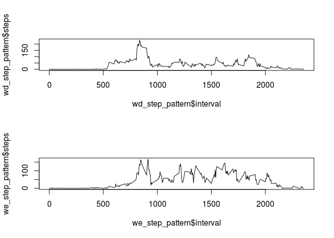

# Reproducible Research: Peer Assessment 1


```
## Loading required package: dplyr
```

```
## 
## Attaching package: 'dplyr'
```

```
## The following objects are masked from 'package:stats':
## 
##     filter, lag
```

```
## The following objects are masked from 'package:base':
## 
##     intersect, setdiff, setequal, union
```

## Loading and preprocessing the data
In order to perofrm this assignment, I must first load the data 


```r
## Download the File
download.file('https://d396qusza40orc.cloudfront.net/repdata%2Fdata%2Factivity.zip', destfile = 'fdata_activity.zip')
unzip('fdata_activity.zip')
data_ <- read.csv('activity.csv', stringsAsFactors = FALSE)
##Rename the 'date' column, because it's a reserved word 
data_$date_ <- data_$`date`
```


## What is mean total number of steps taken per day?

How many steps are taken per day, on average? Ignoring N/As: 

To accomplish this, sum daily step totals


```r
##sum the total steps per day
daily_steps <- data_ %>% select(date_, steps) %>%
  group_by(date_) %>%
  summarize(steps = sum(steps))
```

Plot them in a histogram:


```r
hist(daily_steps$steps)
```

<!-- -->

What are the actual mean and median of steps per day?


```r
mean(daily_steps$steps, na.rm = TRUE)
```

```
## [1] 10766.19
```

```r
median(daily_steps$steps, na.rm = TRUE)
```

```
## [1] 10765
```

## What is the average daily activity pattern?

In a given day, what does the average activity pattern look like? 


```r
##I need a mean function that ignores NAs. because dplyr doesn't handle summary 
##functions with mutlple parameters
mean_na.rm <- function(x){mean(x, na.rm=TRUE)}
##sum the total steps per day
step_pattern <- data_ %>% select(interval, steps) %>%
  group_by(interval) %>%
  summarize(steps = mean_na.rm(steps))

##display them in a plot
plot(x = step_pattern$interval, y = step_pattern$steps, type = 'l')
```

<!-- -->

The five minute period that contains, on average, the most steps is:


```r
step_pattern[which.max(step_pattern$steps),]
```

```
## # A tibble: 1 x 2
##   interval    steps
##      <int>    <dbl>
## 1      835 206.1698
```

## Imputing missing values

How many rows contain empty values?


```r
length(is.na(data_$steps))
```

```
## [1] 17568
```

How do we impute values for these missing values? 
Take the mean ignoring NAs for the same 5 minute interval


```r
## Join the original dataset with the step pattern dataset on the interval as a key
impute_data <- merge(x = data_, y = step_pattern, by.x = 'interval', by.y = 'interval')
## Resolve the dataset by replacing null steps values with the interval average
impute_data$impute_steps <- impute_data$steps.x
impute_data <- within(impute_data, impute_steps[is.na(impute_steps)] <- steps.y[is.na(impute_steps)])
##Drop what I don't need
impute_data <- impute_data[,c('interval', 'date_', 'impute_steps')]
```

Compare the histogram, mean, and medians of these vales againt the raw dataset


```r
##sum the total steps per day
daily_steps <- impute_data %>% select(date_, impute_steps) %>%
  group_by(date_) %>%
  summarize(steps = sum(impute_steps))

hist(daily_steps$steps)
```

<!-- -->

```r
mean(daily_steps$steps)
```

```
## [1] 10766.19
```

```r
median(daily_steps$steps)
```

```
## [1] 10766.19
```

Note that the frequency of the number of steps in any given interval increased more tightly around the mean, IE: the numeric mean interval saw the greatest increse, followed by those in the immeidately adjacent frequencies, and the overall mean and median are relatively unchanged. 


## Are there differences in activity patterns between weekdays and weekends?

Are there differences in activity patterns between weekdays and weekends?


```r
##determine if the given dates are weekdays or weekends
## convert dates to day names
impute_data$is_weekend <- weekdays(as.Date(impute_data$date_, format = "%Y-%m-%d"))
## detect and flag weekend days
impute_data$is_weekend <- impute_data$is_weekend %in% c('Saturday', 'Sunday')
## name them 
impute_data$is_weekend_str[impute_data$is_weekend == TRUE] <- 'Weekend' 
impute_data$is_weekend_str[impute_data$is_weekend == FALSE] <- 'Weekday' 
## convert them to a factor 
impute_data$is_weekend_ftr <- as.factor(impute_data$is_weekend_str)
##summarize the data by weekend / weekday by period 

w_step_pattern <- impute_data %>% select(interval, is_weekend_ftr, impute_steps) %>%
  group_by(interval, is_weekend_ftr) %>%
  summarize(steps = mean(impute_steps))

wd_step_pattern <- w_step_pattern[w_step_pattern$is_weekend_ftr == 'Weekday',]
we_step_pattern <- w_step_pattern[w_step_pattern$is_weekend_ftr == 'Weekend',]
##chart the results 
par(mfrow = c(2,1))
plot(x = wd_step_pattern$interval, y = wd_step_pattern$steps, type = 'l')
plot(x = we_step_pattern$interval, y = we_step_pattern$steps, type = 'l')
```

<!-- -->

